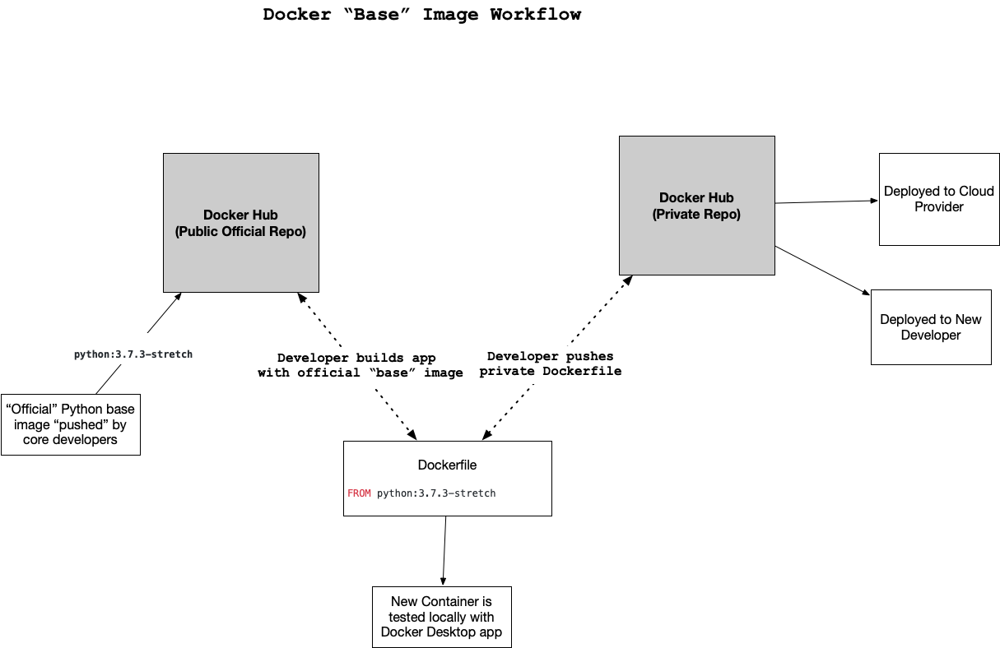

# Docker and Kubernetes

## Docker

(image from Udacity)

- 'Dockerfile' components:
    - 'FROM': Base image from Docker Hub
    - 'WORKDIR': set working directory
    - 'COPY': copying files from local to docker container (etc.)
    - `EXPOSE: expose port
    - 'RUN': commands to run when launched
    - 'CMD': commands to run in the end when launched (ex : `CMD ["python", "sample.py"]`)

 - Docker commands:  
    - To build a dockaer container: `docker build -t <tag name> .`
    - To see docker images: `docker image ls`
    - To see docker containers: `docker ps`
    - To run a docker container and enter it: `docker run -it container name> bash ` 
    - To exit from a docker conatiner: `exit`  
    - To run a docker container at specific port: `docker run -p <port> <name> ` To remove all containers  `docker rm $(docker ps -aq)`
    - To push a container to AWS ECR 
        - Login  `(aws ecr get-login --no-include-email --region us-east-1)`
        - Build the container locally: `docker build -t <name> .` 
        - Register the container: `docker tag <name>:<registry unique URL>/<name>:latest`
        - Push: `docker push <register>/<name>:latest`
    - To see ports: `docker port <name>`

- Cloud Services for Docker
    - Amazon ECR (Elastic Container Registry)

## Makefile

- This is to run multiple shell codes in sequence 
- To run Makefile: `make <title in Makefile>` for example, 
    - `make install`
    - `make all`   

## Kubernetes 
 - Kubernetes does:  
      - Secure high availability and auto-scaling
      - manage container health 
      - manage secrets and configuration 
      - is open-source and little vendor lockin 
 - Kubernates hierarchy 
    - cluster
        - Kubernates master:  w. Kubernates API
        - nodes 
            - pods (scaling is at this level)
                - containers 
 - examples of usage
    - one pod has application and another pod does monitoring
    - one node has application and another pod has resources(database)

 - to run kubernetes
      - on local env: use `minikube` 
      - on cloud: EKS(Amazon), GKE(Google), AKS(Azure)
 - to install kubectl command: 
    - sudo apt-get update && sudo apt-get install -y apt-transport-https
    - curl -s https://packages.cloud.google.com/apt/doc/apt-key.gpg | sudo apt-key add -
    - echo "deb https://apt.kubernetes.io/ kubernetes-xenial main" | sudo tee -a /etc/apt/sources.list.d/kubernetes.list
    - sudo apt-get update
    - sudo apt-get install -y kubectl

 - to install minikube (this is to run clusters locally) 
    - `sysctl -a | grep machdep.cpu.features` 
 - To start minikube: `minikubte start` 
 - To get cluster-info: `kubectl cluster-info`
 - To run: `kubectl run <name> --generator=<generator> --image=<image> --port=<port> -- labels app=<pod name>`
 - To forward `kubectl port-forward <app> 8000:80` 
 - To see available nodes: `kubectl get nodes` 
 - To see available pods: `kubetcl get pods` 
 - To get a list of deployed apps: `kubectl get deployments`
 - To see log: `kubectl logs <pod name>` 
 - To check status of pods (incl. error messages): ` kubectl describe pods` 
 - To scale: `kubectl scale deployments/<deployment name> --replicas=<desired number of replicas>`
 - The website has good tutorial https://kubernetes.io/docs/tutorials/kubernetes-basics/create-cluster/cluster-interactive/

## Linux Commands 
   - To see the system info: `uname -a`
   - To write string in a file: `echo "Hello!" >> README.md` 
   - To see the location of a program: `which python3` 
   - `&&` do the next command if previous command is successful 
   - To make an alias: `alias vi='vim'`
   - To add execution permisssion `chmod +x <file>`
   - To unzip: `tar zxvf <file>` 
   - To check disk usage:
      - `df -h`
      - `ncdu` (needs install)
   - To run shell file
      - `bash file.sh` or `sh file.sh` or 
      - `chmod +x ./file.sh && ./file.sh` 
   - Shell file needs following string at the beginning `#!/bin/bash` (shebang)

## Linux key files
   - ~/.bashrc 
        - To activate: `source ~/.bashrc`

## Text editor for Linux
   -  `vim`
       - to exit: `:q`
   - `nano`

## Install libraries 
   - Python 
        - `pip install --ugprade pip`
        - `pip install -r requirements.txt` 
   - NodeJS
        -  XX

## Commands for AWS CLI:
   - To show crednetials: `aws configure list`
## Services/Tools 
- Prometheus: for monitoring Kubernetes. 
    - to setup
       - download executable from prometheus website
       - untar on VM (ex. EC2, Cloud9)
       - go to the prometheus directory 
       - open up inbound port (default 9090) of the VM 
       - run prometeus: `./prometheus --config.file=prometheus.yml` 
       - access to `<VM's IP address>:9090/metrics` to see metric
   - to add metric: 
       - `<VM's IP address>:9090/graph`
       - choose metric at `expression` and `execute`

    - 
- Swagger: creation of API documentation
- LOCUST: load testing 
- Hadolint 
   - to install 
       `sudo wget -O /bin/hadolint https://github.com/hadolint/hadolint/releases/download/v1.17.5/hadolint-Linux-x86_64` 
       `sudo chmod +x /bin/hadolint`
- CircleCI
   - `curl -fLSs https://circle.ci/cli | bash` 
   

